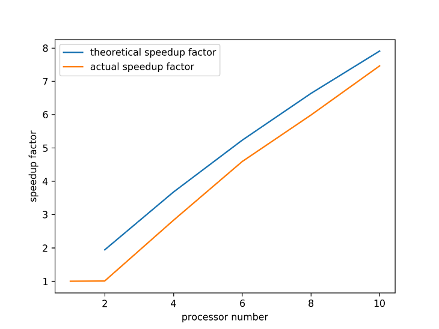
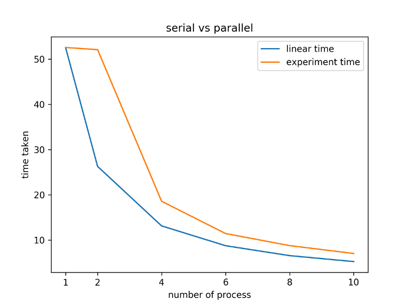
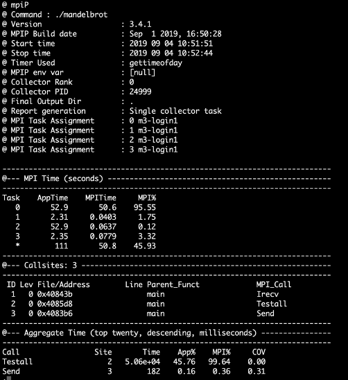
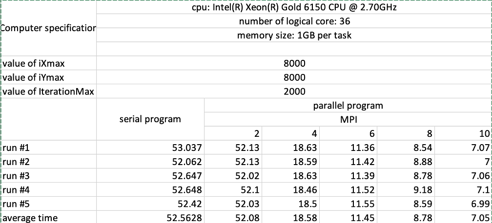

# parallel_mandelbrot
Generate visualization of mandelbrot set (https://en.wikipedia.org/wiki/Mandelbrot_set) on HPC system. 
## requirments
* OpenMPI >= 1.10.7
* make 
## Compile
```
cd parallel
make 
```
## run
```
cd parallel
make run
```

### batch submission
if you have slurm on your system, you can submit multiple runs to generate comparable result by
```
sbatch runall.sh
```
It will run serial.sh once and parallel.sh with 2,4,6,10 cores. You can change sequence in runall.sh or parallel.sh to test other configuration
you may need to change some parameters on slurm script (most likely partition name) depending on which system you are using

## Result


theoretical vs actual speedup factor



theoretical vs actual time



profiling output 


Full experiment outcome and hardward config


### report generation
if you have submitted by batch, you can run 
```
python report.py 
```
to generate cores vs speedup
### profile
You can also profile (if you have MPIP installed http://mpip.sourceforge.net/) the execution by 
```
cd parallel
make profile
```
it will add a set of flags of MPIP to mpirun call. You need to replace those paths in makefile to whereever your mpip is installed
## complete analysis
See report/Report.pdf
